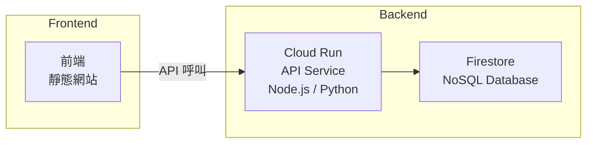

# Google Cloud Run 靜態網站部署 Skill

## 概述

將靜態前端專案（HTML/CSS/JS）部署到 Google Cloud Run 的完整流程。使用 Nginx 作為網頁伺服器容器，透過 Cloud Build 自動化建置與部署。

---

## 適用場景

- 靜態網站 / SPA（Single Page Application）
- 前端遊戲（如 2048）
- 純前端工具頁面
- 任何不需要後端邏輯的網頁專案

---

## 事前考量與檢查清單

### 1. GCP 專案準備

| 項目 | 說明 | 指令 |
|------|------|------|
| **GCP 專案** | 需要一個 Google Cloud 專案 | `gcloud projects list` |
| **Cloud Run API** | 必須啟用 | `gcloud services enable run.googleapis.com` |
| **Cloud Build API** | 必須啟用 | `gcloud services enable cloudbuild.googleapis.com` |
| **Artifact Registry API** | 必須啟用 | `gcloud services enable artifactregistry.googleapis.com` |
| **Artifact Registry 倉庫** | 存放 Docker 映像 | `gcloud artifacts repositories create REPO_NAME --repository-format=docker --location=REGION` |

### 2. 本地環境需求

| 工具 | 用途 | 安裝方式 |
|------|------|----------|
| **Google Cloud SDK** | 與 GCP 互動 | https://cloud.google.com/sdk/docs/install |
| **Docker**（可選） | 本地測試容器 | https://docs.docker.com/get-docker/ |
| **Git** | 版本控制 | https://git-scm.com/ |

### 3. 服務帳號權限

Cloud Build 使用的服務帳號（預設為 `PROJECT_NUMBER-compute@developer.gserviceaccount.com`）需要以下權限：

| 角色 | 用途 |
|------|------|
| `roles/storage.objectAdmin` | 存取 Cloud Storage 中的原始碼 |
| `roles/artifactregistry.writer` | 推送 Docker 映像到 Artifact Registry |
| `roles/run.admin` | 部署到 Cloud Run |
| `roles/iam.serviceAccountUser` | 以服務帳號身份執行 |
| `roles/logging.logWriter` | 寫入日誌 |

> **注意**：如果遇到 `storage.objects.get` 權限錯誤，就是缺少 `roles/storage.objectAdmin`。

### 4. Cloud Run 服務名稱限制

| 規則 | 說明 |
|------|------|
| 只能包含**小寫字母、數字、連字號** |
| 必須以**字母開頭** |
| 不能以連字號結尾 |
| 長度小於 64 字元 |

> **錯誤範例**：`2048-game` ❌（數字開頭）
> **正確範例**：`game-2048` ✅

### 5. Cloud Run 容器注意事項

| 項目 | 說明 |
|------|------|
| **PORT 環境變數** | Cloud Run 會注入 `PORT` 環境變數（預設 8080），容器必須監聽此埠 |
| **動態 PORT** | Nginx 不會自動讀取環境變數，需要使用 `envsubst` 動態替換 |
| **非 root 使用者** | Cloud Run 以隨機非 root 使用者執行容器，但 Nginx 以 root 啟動是安全的（容器有沙箱保護） |
| **冷啟動** | 首次請求約 1-2 秒延遲，可設定 `--min-instances=1` 解決 |
| **最大執行個體** | 建議設為 `--max-instances=2` 控制成本 |

---

## 專案檔案結構

```
your-project/
├── src/                       # 前端原始碼目錄
│   ├── index.html
│   ├── css/
│   ├── js/
│   └── ...
├── Dockerfile                 # Nginx 容器映像檔
├── nginx.conf                 # Nginx 設定檔（使用 ${PORT} 變數）
├── cloudbuild.yaml            # Cloud Build CI/CD 設定
├── deploy.sh                  # 一鍵部署腳本
├── .gcloudignore              # GCP 部署忽略清單
└── .gitignore                 # Git 忽略清單
```

---

## 各檔案範本與說明

### Dockerfile

```dockerfile
# ============================================
# 靜態網站 - Cloud Run Deployment
# Base: nginx:alpine (最小映像，約 20MB)
# ============================================

FROM nginx:alpine

# 安裝 envsubst（用於動態替換 nginx 設定中的 PORT 變數）
RUN apk add --no-cache gettext

# 移除預設的 Nginx 靜態檔案
RUN rm -rf /usr/share/nginx/html/*

# 複製 Nginx 設定模板（使用 ${PORT} 變數）
COPY nginx.conf /etc/nginx/conf.d/default.conf.template

# 複製前端原始碼
COPY src/ /usr/share/nginx/html

# 設定檔案權限
RUN chmod -R 755 /usr/share/nginx/html

EXPOSE 8080

# 使用 entrypoint script 動態替換 PORT 變數
CMD ["/bin/sh", "-c", \
     "envsubst '${PORT}' < /etc/nginx/conf.d/default.conf.template > /etc/nginx/conf.d/default.conf && \
      nginx -g 'daemon off;'"]
```

**關鍵設計決策**：
- `nginx:alpine`：最小映像，約 20MB
- `gettext` 套件：提供 `envsubst` 指令，用於動態替換 PORT
- `default.conf.template`：使用 `${PORT}` 變數的模板檔
- 以 root 啟動 Nginx：Cloud Run 容器有沙箱保護，安全無虞

### nginx.conf

```nginx
server {
    # Cloud Run 會透過 PORT 環境變數指定監聽埠
    # envsubst 會在容器啟動時將 ${PORT} 替換為實際值
    listen ${PORT};
    server_name _;

    root /usr/share/nginx/html;
    index index.html;

    # Gzip 壓縮
    gzip on;
    gzip_types text/plain text/css application/json application/javascript text/xml application/xml text/javascript image/svg+xml;
    gzip_min_length 256;
    gzip_vary on;

    # 靜態檔案快取（瀏覽器快取 1 年）
    location ~* \.(jpg|jpeg|png|gif|ico|svg|woff|woff2|eot|ttf|css|js)$ {
        expires 1y;
        add_header Cache-Control "public, immutable";
    }

    # 主要入口（SPA fallback）
    location / {
        try_files $uri $uri/ /index.html;
    }

    # 安全性標頭
    add_header X-Frame-Options "SAMEORIGIN" always;
    add_header X-Content-Type-Options "nosniff" always;
    add_header X-XSS-Protection "1; mode=block" always;
}
```

### cloudbuild.yaml

```yaml
# ============================================
# Cloud Build CI/CD 設定
# ============================================

steps:
  # 步驟 1：建置 Docker 映像
  - name: 'gcr.io/cloud-builders/docker'
    args:
      - 'build'
      - '-t'
      - '${_REGION}-docker.pkg.dev/${PROJECT_ID}/${_REPO_NAME}/${_SERVICE_NAME}:${_TAG}'
      - '.'

  # 步驟 2：推送映像到 Artifact Registry
  - name: 'gcr.io/cloud-builders/docker'
    args:
      - 'push'
      - '${_REGION}-docker.pkg.dev/${PROJECT_ID}/${_REPO_NAME}/${_SERVICE_NAME}:${_TAG}'

  # 步驟 3：部署到 Cloud Run
  - name: 'gcr.io/google.com/cloudsdktool/cloud-sdk'
    entrypoint: gcloud
    args:
      - 'run'
      - 'deploy'
      - '${_SERVICE_NAME}'
      - '--image=${_REGION}-docker.pkg.dev/${PROJECT_ID}/${_REPO_NAME}/${_SERVICE_NAME}:${_TAG}'
      - '--region=${_REGION}'
      - '--platform=managed'
      - '--allow-unauthenticated'
      - '--memory=128Mi'
      - '--cpu=1'
      - '--min-instances=0'
      - '--max-instances=2'
      - '--concurrency=80'
      - '--timeout=300'

images:
  - '${_REGION}-docker.pkg.dev/${PROJECT_ID}/${_REPO_NAME}/${_SERVICE_NAME}:${_TAG}'

substitutions:
  _REGION: asia-east1
  _REPO_NAME: my-repo
  _SERVICE_NAME: my-service
  _TAG: latest
```

**substitutions 說明**：

| 變數 | 說明 | 範例 |
|------|------|------|
| `_REGION` | GCP 區域 | `asia-east1`（台灣） |
| `_REPO_NAME` | Artifact Registry 倉庫名稱 | `my-repo` |
| `_SERVICE_NAME` | Cloud Run 服務名稱 | `my-service` |
| `_TAG` | Docker 映像標籤 | `latest` |

### deploy.sh

```bash
#!/bin/bash
set -e

# 顏色輸出
RED='\033[0;31m'
GREEN='\033[0;32m'
YELLOW='\033[1;33m'
NC='\033[0m'

echo -e "${GREEN}========================================${NC}"
echo -e "${GREEN}  部署到 Cloud Run${NC}"
echo -e "${GREEN}========================================${NC}"

# 檢查 gcloud 是否安裝
if ! command -v gcloud &> /dev/null; then
    echo -e "${RED}錯誤：找不到 gcloud 指令${NC}"
    echo "請先安裝 Google Cloud SDK: https://cloud.google.com/sdk/docs/install"
    exit 1
fi

# 檢查是否已登入
if ! gcloud auth list --filter=status:ACTIVE --format="value(account)" &> /dev/null; then
    echo -e "${YELLOW}請先登入 Google Cloud${NC}"
    gcloud auth login
fi

# 取得當前專案 ID
PROJECT_ID=$(gcloud config get-value project 2>/dev/null)
if [ -z "$PROJECT_ID" ]; then
    echo -e "${YELLOW}請輸入您的 GCP 專案 ID：${NC}"
    read -r PROJECT_ID
    gcloud config set project "$PROJECT_ID"
fi

echo -e "${GREEN}專案 ID: ${PROJECT_ID}${NC}"

# 確認部署
read -p "是否繼續部署？(y/N): " confirm
if [[ ! "$confirm" =~ ^[Yy]$ ]]; then
    echo "部署已取消"
    exit 0
fi

# 執行 Cloud Build
gcloud builds submit \
    --config=cloudbuild.yaml \
    --substitutions=_REGION=asia-east1,_REPO_NAME=my-repo,_SERVICE_NAME=my-service,_TAG=latest \
    .

# 取得部署網址
SERVICE_URL=$(gcloud run services describe my-service \
    --region=asia-east1 \
    --format="value(status.url)" 2>/dev/null)

if [ -n "$SERVICE_URL" ]; then
    echo -e "${GREEN}部署完成！${NC}"
    echo -e "服務網址：${YELLOW}${SERVICE_URL}${NC}"
fi
```

### .gcloudignore

```
# Git
.git
.gitignore

# 文件
*.md
README*

# 計畫與設計文件
plans/

# IDE 設定
.idea/
.vscode/
*.swp
*.swo

# OS 檔案
.DS_Store
Thumbs.db
```

---

## 完整部署流程

### 第一步：初始化專案

```bash
# 建立專案目錄
mkdir my-project && cd my-project

# 放入前端原始碼（index.html, css/, js/ 等）
# 建立 Dockerfile、nginx.conf、cloudbuild.yaml、deploy.sh、.gcloudignore
```

### 第二步：初始化 Git 並推送到 GitHub（可選）

```bash
git init
git add .
git commit -m "Initial commit"
git remote add origin https://github.com/YOUR_USER/YOUR_REPO.git
git branch -M main
git push -u origin main
```

### 第三步：設定 GCP 環境

```bash
# 1. 登入
gcloud auth login

# 2. 設定專案
gcloud config set project YOUR_PROJECT_ID

# 3. 啟用必要 API
gcloud services enable run.googleapis.com cloudbuild.googleapis.com artifactregistry.googleapis.com

# 4. 建立 Artifact Registry 倉庫
gcloud artifacts repositories create my-repo \
  --repository-format=docker \
  --location=asia-east1

# 5. 授予 Cloud Build 服務帳號儲存桶權限（如果遇到 403 錯誤）
# 先取得專案編號
PROJECT_NUMBER=$(gcloud projects describe YOUR_PROJECT_ID --format="value(projectNumber)")
gcloud projects add-iam-policy-binding YOUR_PROJECT_ID \
  --member="serviceAccount:${PROJECT_NUMBER}-compute@developer.gserviceaccount.com" \
  --role="roles/storage.objectAdmin"
```

### 第四步：部署

```bash
# 方式 A：一鍵部署腳本
chmod +x deploy.sh
./deploy.sh

# 方式 B：直接執行 Cloud Build
gcloud builds submit \
  --config=cloudbuild.yaml \
  --substitutions=_REGION=asia-east1,_REPO_NAME=my-repo,_SERVICE_NAME=my-service,_TAG=latest \
  .
```

### 第五步：驗證

```bash
# 取得服務網址
gcloud run services describe my-service --region=asia-east1 --format="value(status.url)"

# 在瀏覽器中打開
# Windows: start https://SERVICE_URL
# macOS: open https://SERVICE_URL
```

---

## 設定 Cloud Build Trigger（自動部署）

每次 `git push` 到 GitHub 時自動觸發部署：

1. 前往 **GCP Console > Cloud Build > Triggers**
2. 點選 **Create Trigger**
3. 設定：
   - **Name**: 任意名稱（如 `auto-deploy`）
   - **Event**: Push to branch
   - **Source**: 連接到你的 GitHub repo
   - **Branch**: `^main$`
   - **Configuration**: `cloudbuild.yaml`（Repository）
4. 點選 **Create**

之後每次 `git push` 到 `main` 分支，Cloud Build 就會自動建置並部署。

---

## 常見錯誤與排解

### 1. `storage.objects.get` 權限錯誤

```
ERROR: (gcloud.builds.submit) INVALID_ARGUMENT: could not resolve source:
googleapi: Error 403: ... does not have storage.objects.get access
```

**原因**：Cloud Build 服務帳號缺少 Storage 權限
**解法**：
```bash
gcloud projects add-iam-policy-binding YOUR_PROJECT_ID \
  --member="serviceAccount:PROJECT_NUMBER-compute@developer.gserviceaccount.com" \
  --role="roles/storage.objectAdmin"
```

### 2. Cloud Run 服務名稱無效

```
ERROR: (gcloud.run.deploy) service.metadata.name:
only lowercase, digits, and hyphens; must begin with letter
```

**原因**：服務名稱以數字開頭
**解法**：將 `2048-game` 改為 `game-2048`

### 3. 容器啟動失敗（PORT 問題）

```
The user-provided container failed to start and listen on the port
defined provided by the PORT=8080 environment variable
```

**原因**：Nginx 沒有監聽 Cloud Run 指定的 PORT
**解法**：使用 `envsubst` 動態替換 nginx.conf 中的 `${PORT}` 變數

### 4. Cloud Build 日誌儲存桶錯誤

```
invalid bucket "PROJECT_ID-cloudbuild-logs"; service account ... does not have access
```

**原因**：`cloudbuild.yaml` 中指定了 `logsBucket` 但服務帳號無權限
**解法**：移除 `logsBucket` 設定，讓 Cloud Build 自動處理

---

## 成本考量

| 項目 | 費用 | 說明 |
|------|------|------|
| **Cloud Run** | 每月 200 萬次請求免費 | 超過後每百萬次 $0.40 USD |
| **Cloud Build** | 每月 120 分鐘免費 | 每次部署約 2 分鐘 |
| **Artifact Registry** | 每月 0.5 GB 免費 | 每個映像約 60MB |
| **總計** | **流量低時幾乎免費** | 適合個人專案與練習 |

---

## 第二階段：加入後端 API

當需要雲端排行榜、使用者認證等功能時：



建議做法：
- 建立獨立的 `api/` 目錄
- 使用 Node.js (Express) 或 Python (FastAPI)
- 資料庫使用 Firestore（與 Cloud Run 同為 GCP 原生服務）
- 在 `cloudbuild.yaml` 中新增第二個 service 的部署步驟
- 前端與後端分屬不同 Cloud Run service，需設定 CORS header
